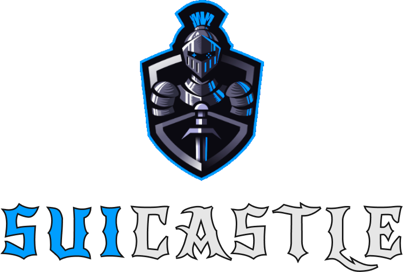

<div align="center">
  
  
  [](https://opensource.org/licenses/MIT)
  [](https://sui.io/)
  [](https://nextjs.org/)
</div>

## 📝 Overview

The initial concept for Suicastle is to leverage zklogin, with sponsorship from Enoki, and build on the Sui network. Our goal is to address the challenges of Web3 game adoption. The game is hosted on Telegram, making it as user-friendly as a typical Web2 game. This approach encourages more people to try out the game without needing complicated setups.

The in-game assets are diverse, allowing users to own various items, such as knights, heroes with special abilities, and unique characters. These items make the game more engaging and offer players different strategies to explore. Players can develop a strong attachment to their game characters. All digital assets are securely recorded using blockchain technology, ensuring true ownership and providing opportunities for players to trade or upgrade their items in the future.

## 🚀 Technologies Used

### Frontend

- **Next.js 14** 
- **TypeScript** - Typed JavaScript
- **Tailwind CSS** - Utility-first CSS framework
- **@mysten/dapp-kit** - Sui wallet integration
- **@tanstack/react-query** - Powerful asynchronous state management

### Blockchain

- **Sui Network** - Layer 1 blockchain
- **Move Language** - Smart contract programming
- **Enoki** - Sui SDK
- **zkLogin** - Zero-knowledge login

### Game Engine

- **Unity** - Game engine
- **React Unity WebGL** - Unity integration with React

## 🛠 Installation

1. Clone repository:

```bash
git clone https://github.com/your-username/suicastle.git
cd suicastle
```

2. Install dependencies:

```bash
npm install
```

3. Create environment file:

```bash
cp .env.local.template .env.local
```

4. Run development server:

```bash
npm run dev
```

## 🏗 Project Structure

```
├── app/                    # Next.js app router
├── components/             # React components
├── contexts/               # React contexts
├── lib/                    # Utility functions
├── types/                  # TypeScript types
└── public/                 # Static assets
```

## 🔐 Smart Contracts

The project uses Move Language to write smart contracts on the Sui Network. Contracts are located in the [Suicastle-Contract](https://github.com/phapdev/Suicastle-Contract) repository.

## 🌐 Environments

The project supports:

- Testnet

## 🎮 Game
The game is built with Unity and React Unity WebGL. The project is located in the [Suicastle-Game](https://github.com/orp1205/Sui-CastleUnity) repository.

## 📄 License

This project is distributed under the MIT License. See `LICENSE` file for more information.

## 🤝 Contact

- Telegram SuiCastle-Teams: [@suicastle](https://t.me/+ecU5JlgcojxkOWQ1)

- Telegram bot: [@suicastle_bot](http://t.me/SuiCastle_bot)

---

<div align="center">
  Made with ❤️ by 
  <a href="https://t.me/+ecU5JlgcojxkOWQ1">SuiCastle Team</a>
</div>
